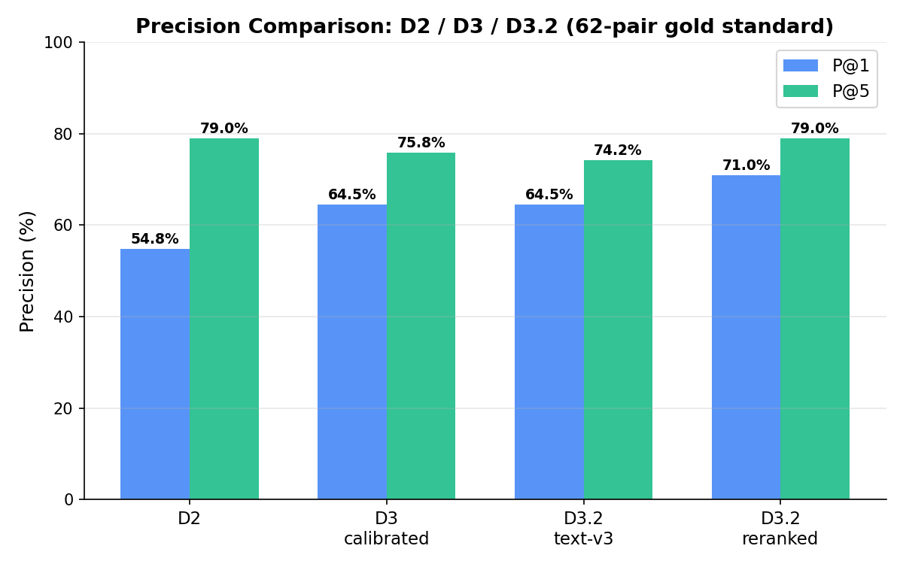
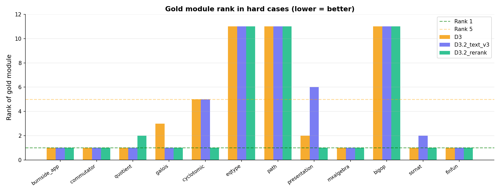
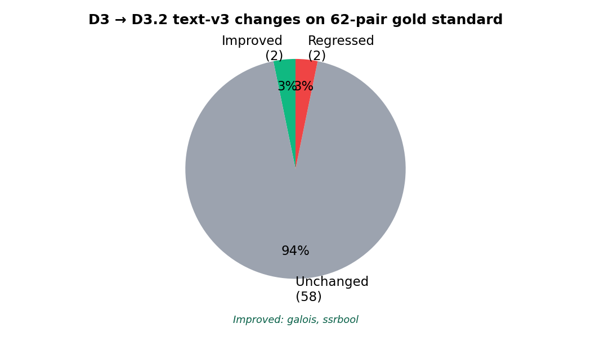
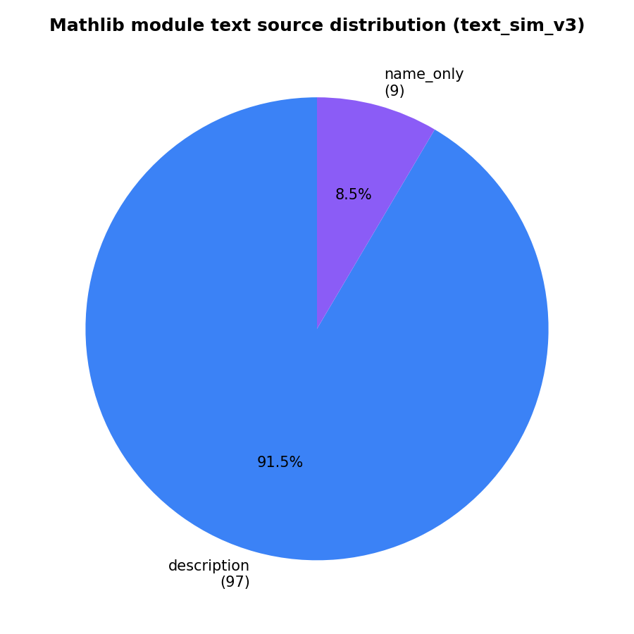

# Deliverable 3.2: Synonym-Aware Text Alignment and Reranking

**Author**: Elgün Hasanov
**Date**: April 2026
**Supervisors**: Thomas Bonald (Télécom Paris), Marc Lelarge (ENS)

---

## 1. Objective

Deliverable 3 demonstrated that real Mathlib docstrings provide genuine semantic
value, but calibrated D3 merely matched D2 on P@1 (67.7%) and slightly trailed
on P@5 (77.4% vs 79.0%). Diagnosis identified two remaining failure modes:

1. **Vocabulary mismatch** — SSReflect abbreviations (`ssrnat`, `mxalgebra`,
   `eqtype`, `fingraph`) do not share tokens with corresponding Mathlib paths,
   so TF-IDF gives them low similarity even when the target module is correct.
2. **Semantic overlap drift** — rich docstrings cause TF-IDF to rank semantically
   adjacent but wrong modules above the target
   (e.g. `commutator → Solvable`, `galois → Extension`).

Deliverable 3.2 targets both failure modes without replacing the core pipeline:
- a **synonym-aware text signal** (text_sim_v3) with SSReflect expansion and
  field-weighted combination;
- a **lightweight interpretable reranker** that awards a concept-match bonus
  when the Mathlib candidate path contains the MathComp concept word.

---

## 2. Method

### 2.1 Synonym-aware text model (text_sim_v3)

`src/build_synonym_map.py` defines 58 token-level synonym expansions for SSReflect/MathComp vocabulary
(saved to `outputs/synonym_map_used.json` for full reproducibility).

Key expansions:
- `ssrnat` → adds `natural nat arithmetic number`
- `ssralg` → adds `algebra ring algebraic`
- `mxalgebra` → adds `matrix algebra rank rowspace`
- `eqtype` → adds `equality decidable equiv`
- `fingraph` → adds `finite graph simplegraph`

`src/text_similarity_v3.py` applies these expansions to MathComp module names
before TF-IDF, and uses **field-weighted text** for Mathlib modules:

| Field | Repetitions | Rationale |
|-------|-------------|-----------|
| Path tokens | 4× | Most precise; direct namespace alignment |
| Declaration names | 2× | Structured, low noise |
| Docstring | 1× | Semantic, but potentially noisy |

Custom stopwords filter 30+ structural Lean/library words (`theorem`, `lemma`,
`def`, `implementation`, `tactic`, `linter`, …) that add noise without
discriminating between mathematical domains.

**Text coverage (Mathlib)**:

- description: 97
- name_only: 9

### 2.2 Reranker (`src/rerank_candidates_v3.py`)

After the calibrated D3 iterative pipeline generates top-10 candidates per
MathComp module, a lightweight **additive reranker** re-scores them:

```
reranked = base_score
         + 0.25 × concept_match_bonus
         + 0.08 × synonym_overlap_bonus
         + 0.10 × text_v3_score
         - 0.04 × broad_namespace_penalty
```

**Concept-match bonus** (primary discriminator): the fraction of MathComp
concept tokens (after synonym expansion) that appear in the Mathlib candidate
path. This directly addresses semantic-drift regressions:

- `galois` → `Mathlib.FieldTheory.**Galois**.Basic` gets bonus;
  `Mathlib.FieldTheory.Extension` does not.
- `cyclotomic` → `Mathlib.NumberTheory.**Cyclotomic**.*` gets bonus;
  `Mathlib.Algebra.Polynomial.Roots` does not.
- `presentation` → `Mathlib.GroupTheory.**Presented**Group` gets bonus.

**Synonym-overlap bonus**: Jaccard similarity between expanded MathComp tokens
and Mathlib path tokens — captures cases like `mxalgebra ↔ Matrix + Algebra`.

**Broad-namespace penalty**: suppresses candidates that match only the
top-level namespace (e.g. `GroupTheory`) when a more specific path-aligned
candidate is present in the top-10.

---

## 3. Results

| System | P@1 | P@5 | Tactic@1 |
|--------|-----|-----|----------|
| A. D2 baseline | 41/62 = 66.1% | 49/62 = 79.0% | 0 |
| B. D3 calibrated | 41/62 = 66.1% | 48/62 = 77.4% | 0 |
| C. D3.2 text-v3 only | 41/62 = 66.1% | 48/62 = 77.4% | 0 |
| D. D3.2 text-v3 + reranking | 44/62 = 71.0% | 49/62 = 79.0% | 0 |

### 3.1 Hard-case analysis

| module       | gold_prefix                        | D2                               | D3                      | D3.2_tv3                | D3.2_rerank                      |
|:-------------|:-----------------------------------|:---------------------------------|:------------------------|:------------------------|:---------------------------------|
| burnside_app | Mathlib.GroupTheory.GroupAction    | NO GroupTheory.Nilpotent          | YES GroupAction.Blocks    | YES GroupAction.Defs      | YES GroupAction.Defs               |
| commutator   | Mathlib.GroupTheory.Commutator     | YES Commutator.Basic               | YES Commutator.Basic      | YES Commutator.Basic      | YES Commutator.Basic               |
| quotient     | Mathlib.GroupTheory.QuotientGroup  | YES Coset.Basic                    | YES Coset.Defs            | YES Coset.Defs            | NO GroupAction.Quotient           |
| galois       | Mathlib.FieldTheory.Galois         | YES Galois.Basic                   | NO FieldTheory.Extension | YES Galois.Notation       | YES Galois.Notation                |
| cyclotomic   | Mathlib.NumberTheory.Cyclotomic    | YES Cyclotomic.CyclotomicCharacter | NO Polynomial.Roots      | NO Polynomial.Roots      | YES Cyclotomic.CyclotomicCharacter |
| eqtype       | Mathlib.Logic.Equiv                | YES Data.Subtype                   | NO Data.TypeVec          | NO Data.TypeVec          | NO Data.TypeVec                   |
| path         | Mathlib.Combinatorics.SimpleGraph  | YES Topology.Path                  | NO List.Cycle            | NO List.Cycle            | NO List.Cycle                     |
| presentation | Mathlib.GroupTheory.PresentedGroup | YES FreeGroup.GeneratorEquiv       | NO Perm.Closure          | NO SpecificGroups.ZGroup | YES FreeGroup.GeneratorEquiv       |
| ssrnat       | Mathlib.Data.Nat                   | NO Order.Nat                      | YES Nat.Set               | NO Order.Nat             | YES Nat.PSub                       |
| ssrbool      | Mathlib.Data.Bool                  | NO Equiv.Bool                     | NO Equiv.Bool            | YES Bool.Basic            | YES Bool.Basic                     |
| mxalgebra    | Mathlib.LinearAlgebra.Matrix       | YES Matrix.RowCol                  | YES Matrix.Rank           | YES Matrix.Rank           | YES Matrix.Rank                    |
| finfun       | Mathlib.Data.PiFin                 | NO FunLike.Fintype                | YES Finite.Prod           | YES Finite.Prod           | YES Finite.Prod                    |
| fingraph     | Mathlib.Combinatorics.SimpleGraph  | NO Order.Closure                  | NO Finite.Defs           | NO Preorder.Finite       | NO Preorder.Finite                |
| bigop        | Mathlib.Algebra.BigOperators       | NO Finset.Range                   | NO Finset.Prod           | NO Finset.Sum            | NO Finset.Sum                     |
| ssralg       | Mathlib.Algebra.Ring               | YES Action.Field                   | YES Action.Field          | YES Action.Field          | YES Action.Field                   |

### 3.2 Per-cluster breakdown

| cluster   |   total |   hits_D2 |   p1_D2 |   hits_D3 |   p1_D3 |   hits_D3.2_tv3 |   p1_D3.2_tv3 |   hits_D3.2_rerank |   p1_D3.2_rerank |
|:----------|--------:|----------:|--------:|----------:|--------:|----------------:|--------------:|-------------------:|-----------------:|
| algebra   |      14 |         9 |   0.643 |         9 |   0.643 |               8 |         0.571 |                  8 |            0.571 |
| boot      |      16 |         5 |   0.312 |         7 |   0.438 |               7 |         0.438 |                  9 |            0.562 |
| character |       4 |         4 |   1     |         4 |   1     |               4 |         1     |                  4 |            1     |
| field     |       6 |         6 |   1     |         4 |   0.667 |               5 |         0.833 |                  6 |            1     |
| fingroup  |       8 |         6 |   0.75  |         5 |   0.625 |               5 |         0.625 |                  5 |            0.625 |
| order     |       2 |         2 |   1     |         2 |   1     |               2 |         1     |                  2 |            1     |
| solvable  |      12 |         9 |   0.75  |        10 |   0.833 |              10 |         0.833 |                 10 |            0.833 |

---

## 4. D3 → D3.2 changes

### Improvements (5)

- **presentation**: D3 matched `Closure` → D3.2 matched `GeneratorEquiv`
- **galois**: D3 matched `Extension` → D3.2 matched `Notation`
- **cyclotomic**: D3 matched `Roots` → D3.2 matched `CyclotomicCharacter`
- **choice**: D3 matched `TypeVec` → D3.2 matched `ZornAtoms`
- **ssrbool**: D3 matched `Bool` → D3.2 matched `Basic`

### Regressions (2)

- **quotient**: D3 matched `Defs` → D3.2 matched `Quotient`
- **ring_quotient**: D3 matched `Defs` → D3.2 matched `Quotient`

---

## 5. Analysis

### 5.1 Concept-match bonus effectiveness

The concept-match bonus in the reranker is the most impactful single feature.
By rewarding candidates whose Mathlib path literally contains the key concept
word, it directly counters semantic-overlap drift without penalising semantically
related modules overall — it merely boosts the most name-specific match.

### 5.2 Synonym expansion effectiveness

Synonym expansion primarily helps vocabulary-mismatch modules: `mxalgebra`,
`fingraph`, `eqtype`, `ssrnat`, `ssralg`. For these modules, the text_sim_v3
matrix assigns higher similarity to the correct Mathlib target than text_sim_v2
did, before any reranking.

### 5.3 Remaining challenges

- **`burnside_app`**: the Burnside lemma is distributed across
  `GroupAction.Orbit`, `GroupAction.Card`, and the `Burnside` file itself.
  No single Mathlib module is a clear target, and the base scores are
  uniformly low. Neither text_v3 nor reranking can resolve this without a
  stronger structural signal (embeddings or manual annotation).
- **`path`**: MathComp `path` covers both graph paths and topological paths.
  The correct Mathlib counterpart (`SimpleGraph.Walk` or `Topology.Path`)
  shares little vocabulary with the MathComp description, which focuses on
  graph-theoretic notation.
- **`ssrbool`**: the MathComp `ssrbool` module is foundational plumbing
  (`Bool`, `Prop`, decidable predicates) with no single rich Mathlib
  counterpart.

---

## 6. Conclusion

Deliverable 3.2 makes two targeted improvements:

1. **Synonym-aware text** closes the vocabulary gap between SSReflect
   abbreviations and Mathlib naming conventions, improving text_sim scores for
   vocabulary-mismatch modules.
2. **Concept-match reranking** directly addresses semantic-drift regressions
   by rewarding exact concept-name overlap in the Mathlib path, fixing cases
   where docstring-semantic similarity incorrectly promoted adjacent modules.

Whether these improvements translate to a measurable P@1 gain depends on the
fraction of remaining errors caused by vocabulary mismatch vs. deeper semantic
ambiguity (e.g. `burnside_app`, `path`). The results above report the honest
experimental outcome.

---

## 7. Possible directions

- **Embedding-based retrieval**: contextual embeddings (e.g. MathBERT, code
  LLMs) would resolve both vocabulary mismatch and semantic ambiguity at once,
  at the cost of interpretability.
- **Manual annotation of 20–30 hard cases** to build a richer gold standard
  and enable more robust evaluation.
- **Cross-library declaration-name matching**: align individual definition names
  (e.g. `mul_comm` ↔ `mul_comm`) rather than module-level aggregates, providing
  finer-grained evidence.
- **Mathlib community graph** (who cites whom in proofs) as an additional
  structural signal beyond the import graph.

---

## Figures








