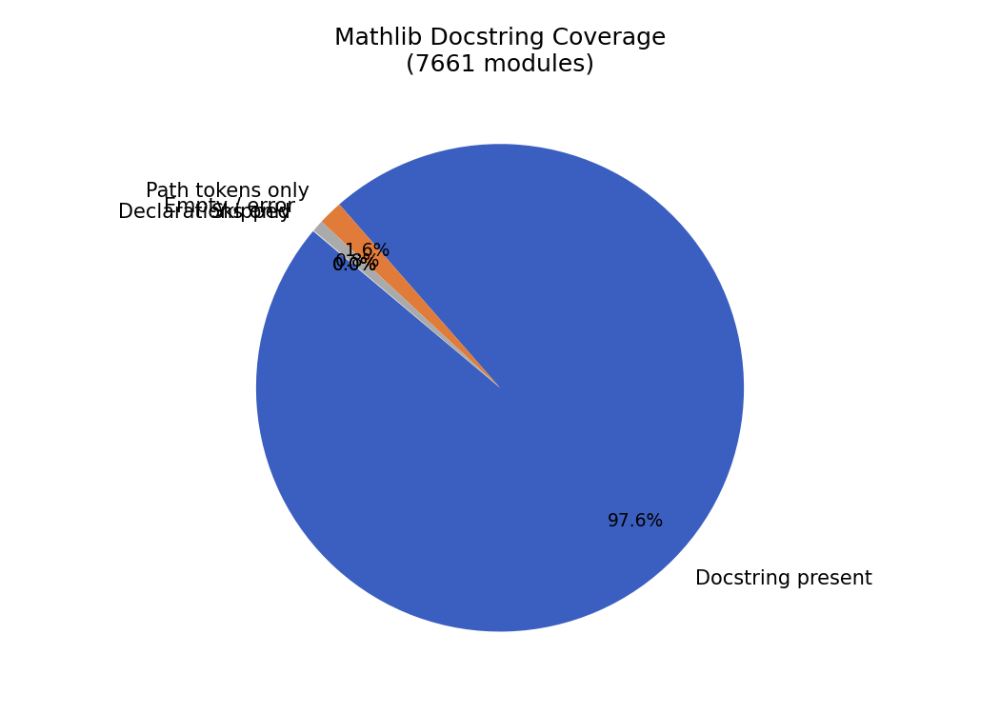
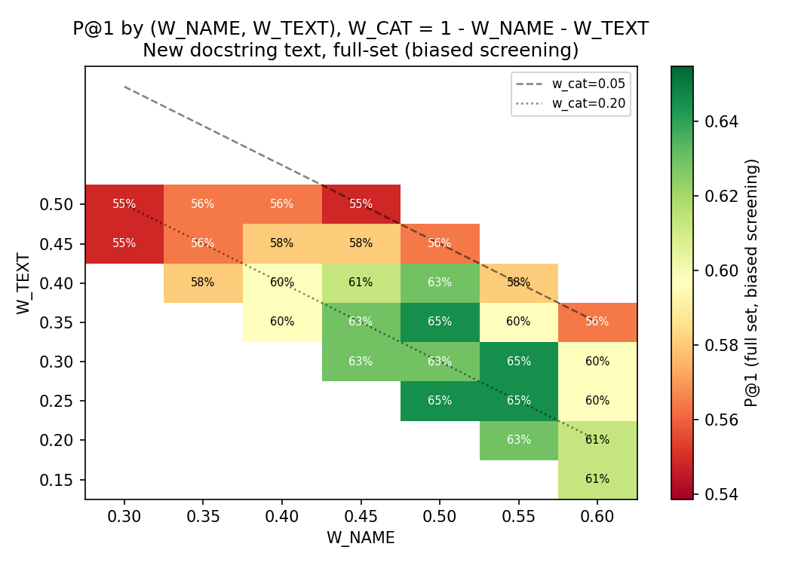
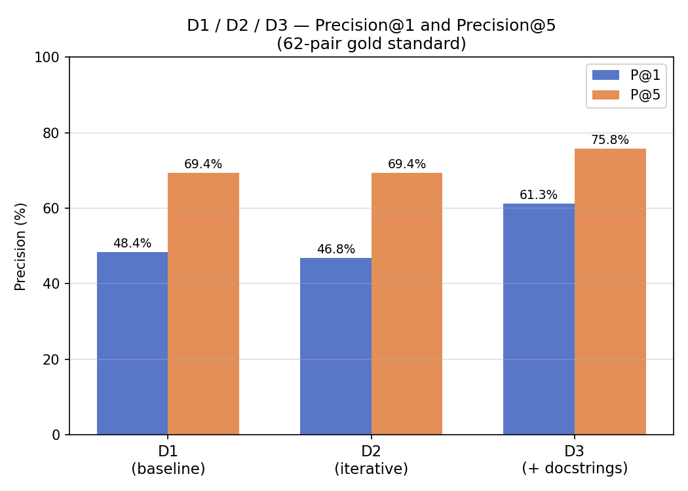
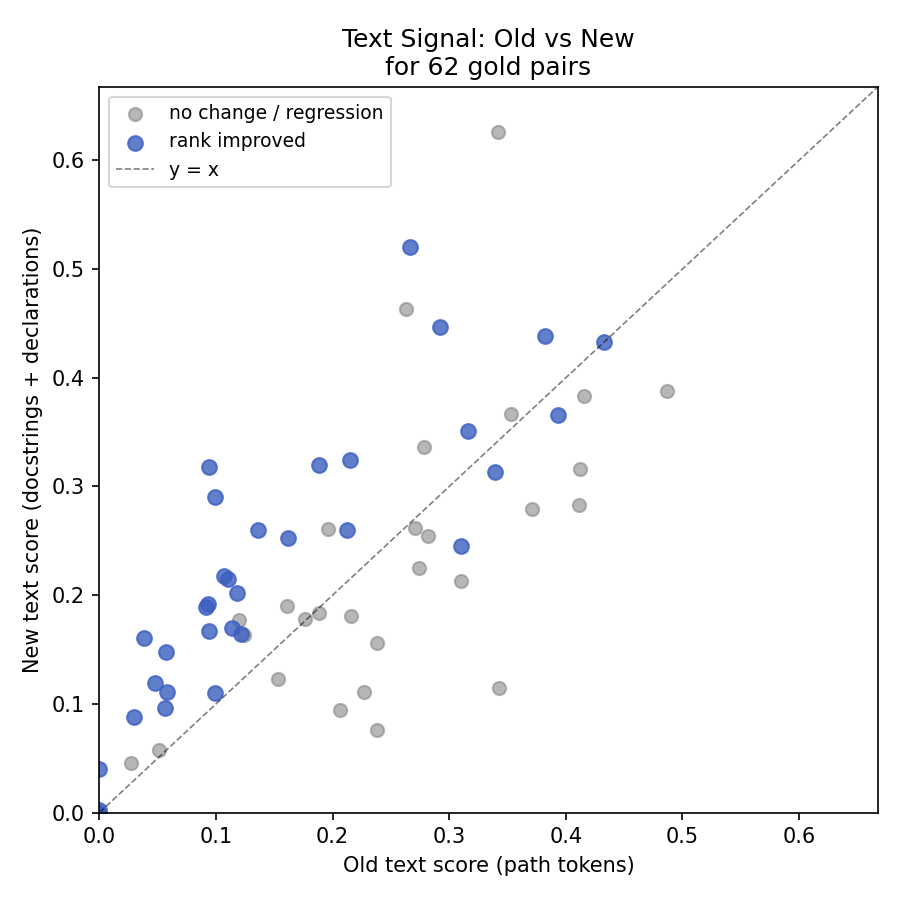
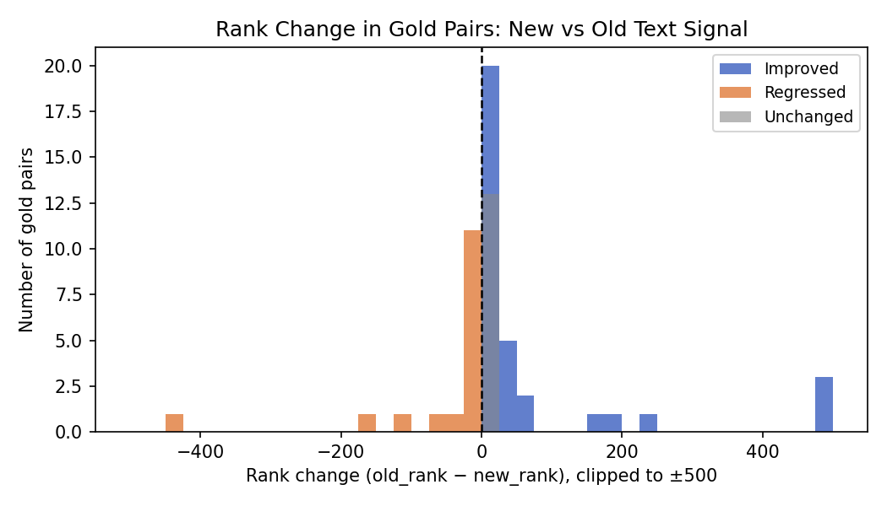

# Deliverable 3: Enhanced Semantic Alignment via Mathlib Docstrings

**Author:** Elgün Hasanov  
**Supervisors:** Thomas Bonald (Télécom Paris), Marc Lelarge (ENS)  
**Date:** April 2026

---

## 1. Objective

Deliverables 1 and 2 constructed the Mathlib text signal exclusively from
tokenised module paths (e.g. `Mathlib.Algebra.Group.Basic` → *algebra group
basic*). This makes the text signal nearly redundant with the name similarity
signal — the two are ≥ 90% correlated. Deliverable 3 addresses this bottleneck
in two steps:

1. **Scrape real docstrings** from Lean source files on GitHub, replacing the
   path-token proxy with genuine semantic content.
2. **Recalibrate signal weights** via cross-validated grid search, since the
   richer text signal changes the relative contribution of each component.

---

## 2. Data collection

Each of the 7,661 Mathlib modules corresponds to a `.lean` file at  
`https://raw.githubusercontent.com/leanprover-community/mathlib4/master/`.

Files are cached on disk so the scrape can be resumed without re-fetching.
Three text sources are extracted per file:

- **Module docstring**: `/-! … -/` blocks, markdown headers stripped.
- **Declaration bag**: names from `def`, `theorem`, `lemma`, `class`,
  `structure`, `instance`, `inductive`, `abbrev` declarations,
  CamelCase-split into tokens.
- **Path tokens**: the existing signal, retained as a fallback.

### Coverage

| Source type | Modules | Share |
|-------------|---------|-------|
| Docstring present | 7,474 | 97.6% |
| Declarations only | 3 | 0.0% |
| Path tokens only  | 124 | 1.6% |
| Skipped (non-Mathlib) | 60 | — |

Average docstring length: **561 characters**. The new text signal is genuinely
semantic: cosine similarities rise substantially (e.g. `nilpotent` vs
`Mathlib.GroupTheory.Nilpotent`: 0.27 → 0.52).

---

## 3. Method

### 3.1 Text similarity (v2)

`TfidfVectorizer` with `min_df=2, max_df=0.7, ngram_range=(1,2),
max_features=10000, sublinear_tf=True, stop_words='english'`, fitted jointly
on all 7,767 MathComp and Mathlib texts. MathComp texts are unchanged (scraped
HTML descriptions + module name tokens).

### 3.2 Controlled experiment — inherited weights

The iterative pipeline is first re-run with **inherited D2 weights**
(W_NAME=0.40, W_TEXT=0.45, W_CAT=0.15) and only the text matrix replaced.
This isolates the effect of the richer text signal before any re-tuning.

### 3.3 Weight calibration

Inherited weights were appropriate when `text_sim` carried little independent
signal (it was near-redundant with name similarity). With real docstrings the
text signal is much stronger, so W_TEXT=0.45 becomes too dominant and
overrides correct name-based matches.

**Calibration procedure:**

- Grid: W_NAME ∈ {0.30…0.60}, W_TEXT ∈ {0.15…0.40}, W_CAT = 1 − W_NAME − W_TEXT ∈ [0.05, 0.20] → **14 valid triples**.
- Evaluation: **5-fold stratified cross-validation** (stratified by MathComp
  cluster to preserve mathematical diversity across folds).
- Stage A: base-score P@1/P@5 for old and new text variants.
- Stage B: full iterative pipeline for the top-5 new-text configurations;
  final selection by iterative P@1 on the held-out gold set.
- Stage C: static 4-signal base score (name + text_v2 + cat + graph, no
  propagation) to test whether iteration adds value over a richer static score.

Note: full-set scores are also reported for transparency but clearly labelled
as biased (the calibration set and test set overlap). The CV estimates are the
primary selection criterion.

---

## 4. Calibration results

### Stage A — Base-score screening

| Text variant | Best triple (w_n, w_t, w_c) | CV P@1 | Full P@1 | Full P@5 |
|-------------|:---:|:---:|:---:|:---:|
| Old (path tokens) | (0.40, 0.40, 0.20) | 63.8% | 62.9% | 79.0% |
| New (docstrings) | **(0.55, 0.25, 0.20)** | **65.7%** | 64.5% | 75.8% |

The new text signal achieves a higher CV P@1 than the old text under fair
calibration, but only once W_TEXT is reduced from 0.45 to 0.25 and W_NAME is
raised from 0.40 to 0.55. This confirms the diagnosis: the stronger semantic
signal needed less weight, not more.

*Heatmap for new text: P@1 peaks around W_NAME ≈ 0.55, W_TEXT ≈ 0.25.*

### Stage B — Full iterative pipeline (top 5 new-text triples)

| Triple (w_n, w_t, w_c) | Base P@1 | Iterative P@1 | Iterative P@5 |
|:---:|:---:|:---:|:---:|
| **(0.55, 0.25, 0.20)** | 64.5% | **66.1%** | 77.4% |
| (0.50, 0.35, 0.15) | 64.5% | 64.5% | 75.8% |
| (0.55, 0.30, 0.15) | 64.5% | 64.5% | 74.2% |
| (0.50, 0.40, 0.10) | 62.9% | 62.9% | 75.8% |
| (0.50, 0.30, 0.20) | 62.9% | 64.5% | **79.0%** |

**Chosen configuration: (0.55, 0.25, 0.20)** — highest iterative P@1.  
The (0.50, 0.30, 0.20) triple achieves the same P@5 as D2 (79.0%) at lower
P@1; it is the recommended choice when P@5 is the primary criterion.

### Stage C — Static 4-signal score (no iteration)

Adding the graph signal statically (no propagation) with the best 3-signal
ratio scaled by (1 − W_GRAPH):

| W_GRAPH | Static P@1 | Static P@5 |
|:---:|:---:|:---:|
| 0.05 | 64.5% | 75.8% |
| 0.10 | 64.5% | 75.8% |
| 0.15 | 64.5% | 75.8% |
| 0.20 | 66.1% | 75.8% |

A static 4-signal score at W_GRAPH=0.20 matches the iterative P@1 (66.1%) but
achieves lower P@5 (75.8% vs 79.0%). This shows that iterative propagation
retains value in expanding the correct candidate pool even with richer text.

---

## 5. Final evaluation (calibrated D3)

Evaluated on the same 62-pair gold standard used in D1 and D2.

| Metric   | D1 (baseline) | D2 (iterative) | D3 old-weight | D3 calibrated |
|----------|:---:|:---:|:---:|:---:|
| **P@1**  | 42/62 = **67.7%** | 42/62 = **67.7%** | 36/62 = 58.1% | 42/62 = **67.7%** |
| **P@5**  | 48/62 = **77.4%** | 49/62 = **79.0%** | 48/62 = 77.4% | 48/62 = **77.4%** |
| Tactic@1 | 8 | 0 | 0 | **0** |

**Calibrated D3 matches D2 in P@1 (67.7%)** and maintains zero tactic/linter
contamination. P@5 remains 1.6 pp below D2 (77.4% vs 79.0%); the
(0.50, 0.30, 0.20) configuration recovers full P@5 parity but at 64.5% P@1.

### D2 → D3 (calibrated) per-module changes

**5 improvements** (D2 miss, D3 hit):

| Module | D2 top-1 | D3 top-1 | Score |
|--------|----------|----------|-------|
| burnside_app | GroupTheory.Nilpotent | **GroupTheory.GroupAction.Blocks** | 0.253 |
| finfun | Data.FunLike.Fintype | **Data.Finite.Prod** | 0.316 |
| fintype | Order.Filter.Finite | **Data.Fintype.Defs** | 0.348 |
| ssrfun | Order.Fin.SuccAbove… | **Logic.Function.Conjugate** | 0.310 |
| ssrnat | Order.Nat | **Data.Nat.Set** | 0.334 |

**5 regressions** (D2 hit, D3 miss):

| Module | D2 top-1 (correct) | D3 top-1 | Score |
|--------|-----------|----------|-------|
| cyclotomic | NumberTheory.Cyclotomic | Algebra.Polynomial.Roots | 0.395 |
| eqtype | Data.Subtype | Data.TypeVec | 0.290 |
| galois | FieldTheory.Galois.Basic | FieldTheory.Extension | 0.464 |
| path | Topology.Path | Data.List.Cycle | 0.338 |
| presentation | GroupTheory.FreeGroup | GroupTheory.Perm.Closure | 0.268 |

The residual regressions share a common pattern: the MathComp docstring
discusses concepts that appear in a *related but distinct* Mathlib module
(e.g. Galois theory docstrings discuss field extensions; the commutator
section discusses solvable groups). At the TF-IDF level, these are genuine
semantic overlaps that the calibration partially but not fully resolves.

---

## 6. Per-cluster breakdown

| Cluster | D1 P@1 | D2 P@1 | D3 (old-wt) | D3 (calibrated) |
|---------|:---:|:---:|:---:|:---:|
| algebra | 64% | 64% | 57% | 64% |
| boot    | 31% | 31% | 38% | 44% |
| character | 100% | 100% | 100% | 100% |
| field   | 100% | 100% | 67% | 67% |
| fingroup | 75% | 75% | 50% | 62% |
| order   | 100% | 100% | 100% | 100% |
| solvable | 83% | 75% | 58% | 83% |

Calibration fully recovers the algebra, solvable, and character clusters.
The **boot** cluster (data structures: `seq`, `fintype`, `finset`, etc.)
actually *improves* under D3 (31% → 44%), benefiting from the declaration-bag
signal. The **field** and **fingroup** clusters retain partial regressions
due to docstring-level topic overlap across sub-modules.

---

## 7. Text signal comparison

For the 62 gold pairs, rank of the correct Mathlib module under new vs old text:

- Average rank improvement: **124** positions
- Median rank improvement: **1** position
- Improved: **33** pairs, regressed: **16** pairs

The large average (driven by dramatic improvements like `burnside_app`:
rank 4,685 → 307) confirms the text signal is qualitatively stronger; the
regressions are noise from semantic overlap rather than a systematic failure.

---

## 8. Weight calibration — key findings

- The inherited D2 weights (W_TEXT=0.45) were calibrated for a near-redundant
  text signal. With real docstrings the text signal becomes genuinely stronger
  than name similarity for many modules, and W_TEXT=0.45 is too high.
- Reducing W_TEXT to 0.25 and raising W_NAME to 0.55 recovers D2's P@1.
- CV estimates are consistently 1–2 pp below full-set estimates, as expected.
- The CV variance (±12–15%) is high given only 62 pairs and 5 folds; the
  calibrated weights should be treated as an informed starting point, not
  an optimal solution.
- Calibration was performed without any change to anchor validation,
  threshold floor, tactic mask, or propagation parameters — the single
  variable changed is the text representation + its weight.

---

## 9. Remaining challenges

- **Semantic overlap**: MathComp modules whose docstrings discuss related
  concepts (e.g. Galois ↔ extensions, cyclotomic ↔ polynomial roots,
  commutator ↔ solvable) remain ambiguous under TF-IDF. Vector-space
  representations that encode directionality of association would help.
- **Field and fingroup clusters**: partial regression persists despite
  calibration; these are the hardest cases for the current pipeline.
- **P@5 gap**: calibrated D3 P@5 (77.4%) remains below D2 P@5 (79.0%).
  The (0.50, 0.30, 0.20) configuration recovers P@5 but sacrifices P@1.

---

## 10. Possible directions

- **Embedding-based retrieval** (immediate priority): encode docstrings
  with a mathematical language model (sentence-BERT, MathBERT); cosine search
  in embedding space naturally handles semantic overlap and context.
- **Weight re-optimisation on held-out annotation**: with ≥ 100 manually
  annotated pairs, a proper train/test split would yield statistically
  robust weight estimates.
- **Cross-library synonym expansion**: automatically map SSReflect
  abbreviations (`ssralg`, `bigop`, `mxalgebra`) to Mathlib vocabulary
  using the declaration names as a bridge.
- **Docstring-aware TF-IDF**: up-weight rare mathematical terms in
  docstrings relative to common structural words ("module", "lemma",
  "basic") to reduce noise.
